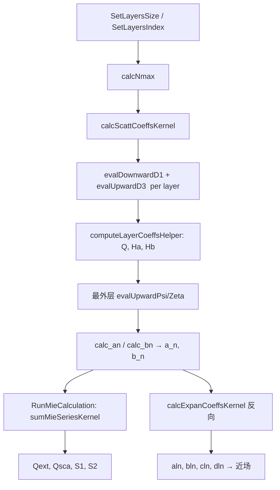

# Scattnlay 学习笔记：多层 Mie 散射、边界匹配与数值防坑

> **非冻结调研笔记**（外部 `~/repos/scattnlay`，非本仓库产品 API）。面向正在实现「孤立多层包心结构」边界匹配（$\mathbf{W}(r)$、$\mathbf{T}_{global}$）的读者。  
> 源码仓库：`~/repos/scattnlay`（[ovidiopr/scattnlay](https://github.com/ovidiopr/scattnlay)）

---

## 〇、重要澄清：Scattnlay 算什么几何？

| 你的说法 | Scattnlay 实际实现 |
|---------|-------------------|
| 多层无限长圆柱 Mie 散射 | **多层球（multilayered sphere）Mie 散射** |

Scattnlay 的全部 C++ 核心（`nmie-basic.hpp`、`special-functions-impl.hpp`）基于 **球坐标 Riccati–Bessel 函数** $\psi_n(z)=z\,j_n(z)$，参考文献是 Peña & Pal (2009) 与 Yang (2003) 的**多层球**算法。

**但工程价值完全成立**：多层圆柱与多层球在算法骨架上同构——逐层边界匹配 + 向内/向外递推 + 对 Bessel 族做**对数导数** + **缩放因子**消溢出。读 Scattnlay 等于读一份「多层 Core-Shell 边界匹配」的工业级参考实现；把 $j_n\to J_m$、$\psi_n\to \sqrt{\rho}\,J_m$ 即可迁移到圆柱问题。

---

## 一、Scattnlay 在算什么？

**物理问题**：平面波入射到 $L$ 层同心球壳（Core-Shell…），求远场散射振幅 $S_1,S_2$、效率因子 $Q_{ext/sca/abs}$，以及各层内部展开系数。

**数学模型**（对每个多极阶 $n=1,2,\ldots,n_{max}$ 独立求解）：

```
入射平面波
    ↓  按 $n$ 分解为 TE/TM 多极子
各层 Riccati–Bessel 展开
    ↓  逐层边界匹配（Ha, Hb 递推 + Q 缩放）
最外层 → 散射系数 a_n, b_n
    ↓  Mie 级数求和
Q_ext, Q_sca, S1(θ), S2(θ)
```

**类比**：每层界面是一道「阻抗匹配」关卡；`Ha`/`Hb` 是每层向外的等效对数导数，`Q` 是防止 Bessel 乘积溢出的缩放累积因子——合起来就是你推导的 $\mathbf{T}_{global}$ 的递推形式，而非显式矩阵乘法。

---

## 二、与你的 $\mathbf{W}(r)$、$\mathbf{T}_{global}$ 的对应关系

### 2.1 单层界面：边界条件 → 对数导数

在半径 $r_l$ 的界面上，TE/TM 场匹配最终化为 Riccati–Bessel **对数导数** $D_1,D_3$ 的代数关系（Peña 论文 Eq. 16–19）。

Scattnlay 定义（与 `tests/mpmath_riccati_bessel.py` 一致）：

$$
D_1(n,z) = \frac{\psi_{n-1}(z)}{\psi_n(z)} - \frac{n}{z}, \quad
D_3(n,z) = \frac{\zeta_{n-1}(z)}{\zeta_n(z)} - \frac{n}{z}
$$

其中 $\psi_n=z j_n$（第一类），$\zeta_n=\psi_n-i\xi_n$（第三类/Hankel 型）。

**这就是「不用显式求 $j_n'$, $h_n'$」的关键**：所有边界条件只出现 $D_1,D_3$ 和 $\psi,\zeta$ 的比值。

对**圆柱**（模 $m$），对应物是：

$$
\mathcal{D}_J = \frac{J_{m-1}(k\rho)}{J_m(k\rho)}, \quad
\mathcal{D}_H = \frac{H^{(1)}_{m-1}(k\rho)}{H^{(1)}_m(k\rho)}
$$

或等价地 $\dfrac{1}{\rho}\dfrac{\partial(\sqrt{\rho}\,J_m)/\partial\rho}{(\sqrt{\rho}\,J_m)}$ —— 与球的 Riccati 包装完全同构。

### 2.2 多层递推：Ha / Hb / Q ≡ 你的 T 矩阵

Yang (2003) 改进递推在代码里由 `computeLayerCoeffsHelper` 实现（`src/nmie-basic.hpp`）。

对每个界面 $l-1 \leftrightarrow l$，给定上一层的 $H_a^{(l-1)}, H_b^{(l-1)}$，计算本层 $H_a^{(l)}, H_b^{(l)}$：

```
Q_l[n]  ←  缩放因子（吸收 ψ·ζ 的量级增长）
Ha_l[n] ←  TE 等效对数导数比
Hb_l[n] ←  TM 等效对数导数比
```

最外层 $l=L-1$ 的 $H_a,H_b$ 代入 `calc_an` / `calc_bn` 得到全局散射系数 $a_n,b_n$（Peña Eq. 5–6）。

**对应关系**：

| 你的符号 | Scattnlay 符号 | 含义 |
|---------|---------------|------|
| $\mathbf{W}(r_l)$ 界面匹配块 | $D_1,D_3$ 在 $z_l=m_l x_l$ 处的值 | 单层 Bessel 边界代数 |
| 层间传播 | `computeLayerCoeffsHelper` 中 $Q,G_1,G_2$ 递推 | 等价于 $\mathbf{T}_{l\to l+1}$ |
| 全局散射 | $a_n,b_n$ | $\mathbf{T}_{global}$ 作用于入射后的输出 |

### 2.3 内部场系数：反向 T 递推

近场需要各层内部展开系数 $a_n^{(l)}, b_n^{(l)}, c_n^{(l)}, d_n^{(l)}$。  
`calcExpanCoeffsKernel`（`src/nmie-nearfield.hpp`）从外向内反向递推：

```cpp
// 初始化：最外假层 L+1 取 a^{L+1}=a_n, c^{L+1}=d^{L+1}=1
for (int l = L - 1; l >= 0; l--) {
  // 用 D1, D3, Psi, Zeta 和下一层系数，求本层 aln, bln, cln, dln
  val_aln = (D1z[n1]*T1 + T3) / denomZeta;
  val_cln = (D3z[n1]*T2 + T4) / denomPsi;
  ...
}
```

这是 **$\mathbf{T}_{global}^{-1}$ 方向** 的系数恢复，用于近场叠加。

---

## 三、文件地图（按阅读顺序）

| 顺序 | 文件 | 干什么 |
|------|------|--------|
| 1 | `src/special-functions-impl.hpp` | **数值核心**：$D_1,D_3,\psi,\zeta$ 的稳定求法 |
| 2 | `src/nmie-basic.hpp` | **多层递推**：`computeLayerCoeffsHelper` → `calcScattCoeffsKernel` → $a_n,b_n$ |
| 3 | `src/nmie-nearfield.hpp` | 内部系数 `calcExpanCoeffsKernel` + 近场矢量球谐 |
| 4 | `tests/test_Riccati_Bessel_logarithmic_derivative.cc` | 与 mpmath / Yang 基准数据对照 |
| 5 | `tests/mpmath_riccati_bessel.py` | Python 参考定义（Le Ru cutoff 等） |
| 6 | `utils/bessel/bessel.cc` | 备用：Zhang & Jin 球 Bessel 向下递推（`csphjy`） |

**入口 API**：

```cpp
nmie::MultiLayerMieApplied<double> mie;
mie.AddTargetLayer(r_core, n_core);
mie.AddTargetLayer(r_shell, n_shell);
mie.SetWavelength(WL);
mie.RunMieCalculation();
double Qabs = mie.GetQabs();
```

---

## 四、贝塞尔导数：为什么用对数导数 $D_1,D_3$？

### 4.1 问题

直接递推 $j_n(z)$ 或计算 $j_n'/j_n$ 在以下情况会 **溢出 / 失精度**：

- $|z|$ 大（大尺寸参数 $x=2\pi r/\lambda$）
- $\mathrm{Im}(z)\neq 0$（吸收介质，$m=n+ik$）
- 阶数 $n$ 高（需要 $n_{max}\sim x+4x^{1/3}$）

### 4.2 Scattnlay 的策略

**不存储** $j_n,h_n$，而存储：

1. **对数导数** $D_1,D_3$ —— 向下递推（稳定）
2. **Riccati 函数** $\psi_n$ —— 向上递推（从 $\psi_0=\sin z$ 开始）
3. **乘积** $\Psi\Zeta_n=\psi_n\zeta_n$ —— 避免单独算 $\zeta_n=\psi_n-i\xi_n$ 时大数相减

核心递推（Peña Eq. 16, 18, 20）在代码中：

```text
evalDownwardD1   : D1[n-1] = n/z - 1/(D1[n] + n/z)   （从 n* 向下）
evalUpwardD3     : ΨΖ[n] = ΨΖ[n-1]·(n/z-D1[n-1])·(n/z-D3[n-1])
                   D3[n]  = D1[n] + i/ΨΖ[n]
evalUpwardPsi    : ψ[n]   = ψ[n-1]·(n/z - D1[n-1])
```

**导数关系**：若 $\psi_n$ 已知，则 $\psi_n' = \psi_n D_1(n,z) + \psi_{n-1}$（由 $D_1$ 定义直接推出）。边界条件里的 $\partial_r(r j_n)/\partial r$ 全部化为 $D_1,D_3$ 与 $\psi,\zeta$ 的代数式 —— **从不需要调用 `j_n'` 或 `h_n'`**。

### 4.3 $D_1[0]=\cot z$ 的防溢出

$n=0$ 时 $D_1=\cot z$。对 $\mathrm{Im}(z)<0$ 的标准 `cos/sin` 会溢出。  
Scattnlay 实现 `complex_cot`（Du 2004, Appl. Opt.）：

```cpp
// special-functions-impl.hpp — 用 exp(-2|Im|) 重写，避免 sin/cos 爆炸
ComplexType complex_cot(const ComplexType z) {
  // 若 Im(z)<0，等价于 conj(cot(conj(z)))
  auto exp_val = exp(-2 * sign(Im) * |Im|);
  // ... 稳定的有理式 ...
}
```

同理 `complex_sin` / `complex_cos` 用 $e^{\pm ib}$ 分解，避免 $\sin(a+ib)$ 直接计算。

---

## 五、Scaling 技巧：Q 因子与 Kapteyn 判据

这是 Scattnlay **最具工程价值** 的部分，也是 Yang 算法相对早期 Wu–Wang 递推的核心改进。

### 5.1 问题：$\psi_n\zeta_n$ 的量级

向内递推时，$\psi_n$ 随 $n$ 指数衰减，$\zeta_n$ 指数增长；直接相乘 $|\psi_n\zeta_n|\sim e^{2|\mathrm{Im}\,z|}$ 很快超出 `double` 范围 → **NaN**。

### 5.2 解法 A：只存乘积 $\Psi\Zeta$，$D_3$ 用 $i/\Psi\Zeta$

`evalUpwardD3` 递推 $\Psi\Zeta_n$，再

$$
D_3(n,z) = D_1(n,z) + \frac{i}{\Psi\Zeta_n}
$$

$D_3$ 本身有界（接近 $i$），**不需要**把 $\psi_n$ 和 $\zeta_n$ 分别算出来。

### 5.3 解法 B：多层 Q 缩放（Yang 算法核心）

`computeLayerCoeffsHelper` 维护每层缩放向量 $Q_l[n]$：

**初始化** $Q_l[0]$（$n=0$ 层间比）：

```cpp
// 用 exp(-2 Im z) 形式，避免 cos/sin 溢出
Num   = exp(-2*(z1.im - z2.im)) * (cos(-2*z2.re) - exp(-2*z2.im))
Denom = cos(-2*z1.re) - exp(-2*z1.im) + i*sin(-2*z1.re)
Q[0]  = Num / Denom
```

**递推** $Q_l[n]$（$n\ge 1$）：

```cpp
ratio_sq = (x_{l-1}/x_l)^2
Q[n] = ratio_sq * Q[n-1]
     * (z1*D1_l + n)*(n - z1*D3_l[n-1])
     / (z2*D1_{l-1} + n)*(n - z2*D3_{l-1}[n-1])
```

**Ha / Hb 更新**（TE/TM 阻抗匹配，已含 Q 除回）：

```cpp
Temp = Q[n] * G1
Ha[n] = (G2*D1_l - Temp*D3_l) / (G2 - Temp)
```

物理含义：$Q$ 吸收了 $\psi,\zeta$ 跨层传递时的指数因子；$H_a,H_b$ 保持 **O(1)** 量级，使最终 $a_n,b_n$ 可精确计算。

### 5.4 解法 C：$D_1$ 向下递推起点 $n^*$（Kapteyn 判据）

`evalDownwardD1` 不直接从 $n_{max}$ 开始，而先算 `nstar = getNStar(nmax, z, valid_digits)`：

```cpp
// evalKapteynNumberOfLostSignificantDigits — 估计向前递推丢失的有效位数
// getNStar — 增大 n* 直到 backwardLoss - forwardLoss > valid_digits
for (n = nstar; n > 0; n--)
  D1[n-1] = n/z - 1/(D1[n] + n/z);
D1[0] = complex_cot(z);
```

直觉：从足够大的 $n^*$ 出发向下递推，$D_1$ 迅速收敛到正确值；比从 $n=0$ 向上递推稳定得多（W. Yang 测试：$x=80, m=1.05+i$，见 `tests/test_Riccati_Bessel_logarithmic_derivative.cc`）。

### 5.5 解法 D：$n_{max}$ 截断

```cpp
// Wiscombe + Le Ru 近场 cutoff
nmax = round(x + 4*x^(1/3) + 2);
nmax = max(nmax, round(|m*x|) for each layer) + 15;
```

高折射率层需额外项 `round(|m_l x_l|)`，否则内层 Bessel 阶数不足。

---

## 六、完整计算流程（代码级）



**逐层循环**（`calcScattCoeffsKernel` 核心）：

```cpp
for (int l = fl + 1; l < L; ++l) {
  z1 = x_l * m_l;           // 本层
  z2 = x_{l-1} * m_l;       // 界面内侧（注意用 m_l 缩放到同一介质）
  evalDownwardD1(z1, D1);   evalUpwardD3(z1, D1, D3, PsiZeta);
  evalDownwardD1(z2, D1_prev); evalUpwardD3(z2, ...);
  computeLayerCoeffsHelper(..., Q[l], Ha[l], Hb[l], Ha[l-1], Hb[l-1]);
}
// 最外层
calc_an(n, x_L, Ha[L-1], m_L, Psi, Zeta, ...) → a_n
calc_bn(n, x_L, Hb[L-1], m_L, ...)             → b_n
```

**PEC 内导体**：`pl >= 0` 时内层 $D_1=-i, D_3=i$，$H_a=H_b=D_1$（完美导体边界）。

---

## 七、迁移到「多层无限长圆柱」的要点

Scattnlay 是球，但算法模板可直接移植：

| 球（Scattnlay） | 圆柱（你的目标） |
|----------------|----------------|
| 阶 $n$（多极） | 方位模 $m$ |
| $\psi_n(z)=zj_n(z)$ | $\tilde{J}_m(\rho)=\sqrt{k\rho}\,J_m(k\rho)$（Riccati 型） |
| $D_1,D_3$ | $\mathcal{D}_J,\mathcal{D}_H$（对数导数比） |
| $H_a,H_b$（TE/TM） | 圆柱 TE/TM 的 $2\times2$ 界面矩阵元素 |
| $Q_l[n]$ 缩放 | 同样必需：$J_m H_m^{(1)}$ 乘积会 overflow |
| Yang 向内递推 | 可参考 [Barber & Hill 1990] 或多层圆柱 Mie 文献 |

**infrastructure 已有基础**（`simulation_core/.../bessel.hpp`）：$J_m, Y_m$ 圆柱 Bessel。缺的是：

1. 复宗量 + 大 $|k\rho|$ 的稳定对数导数递推（照抄 `evalDownwardD1` 结构）
2. 多层 Q 缩放递推（照抄 `computeLayerCoeffsHelper` 结构）
3. 显式 $\mathbf{W}(r)$ 若需要，可由 $D_J,D_H$ 在每层半径组装

---

## 八、测试与验证资源

| 测试 | 验证什么 |
|------|---------|
| `tests/test_Riccati_Bessel_logarithmic_derivative.cc` | $D_1,D_3,\psi$ vs mpmath 30 位 |
| `D1test/WYang_data` | Yang 论文 $x=80, m=1.05+i$ 极端案例 |
| `tests/test_SIMD_Riccati_Bessel.cc` | SIMD 路径与标量一致 |
| `tests/mpmath_riccati_bessel.py` | 生成基准、Le Ru cutoff |
| `tests/shell/test*.sh` | 多层球壳 CLI 回归 |

**W. Yang 基准**（Appl. Opt. 42, 1710, 2003）：$x=80$，双层 $m=\{1.05,1\}$，$n$ 至 130 时 forward 递推失效、downward + $n^*$ 仍正确 —— 这是必须用 Kapteyn/$n^*$ 的铁证。

---

## 九、关键代码片段索引

### 9.1 对数导数向下递推

```442:475:../scattnlay/src/special-functions-impl.hpp
void evalDownwardD1(const ComplexType z, ContainerType& D1) {
  int nstar = NStarCalculator<...>::get(nmax, z, valid_digits);
  // D1[nstar] = 0，向下递推
  for (unsigned int n = nstar; n > 0; n--) {
    auto res = n/z - 1/(D1[n] + n/z);
    D1[n-1] = res;
  }
  D1[0] = complex_cot(z);
}
```

### 9.2 Q / Ha / Hb 层间递推

```156:257:../scattnlay/src/nmie-basic.hpp
void computeLayerCoeffsHelper(...) {
  // Q[0]: exp 稳定形式
  // Q[n]: ratio_sq * Q[n-1] * Num/Denom
  // Ha[n], Hb[n]: 含 Q 的 TE/TM 阻抗匹配
}
```

### 9.3 散射系数

```62:74:../scattnlay/src/nmie-basic.hpp
ComplexType calc_an(..., ComplexType Ha, ComplexType mL,
                    ComplexType PsiXL, ComplexType ZetaXL, ...) {
  auto term1 = (Ha / mL) + (n / XL);
  return (term1 * PsiXL - PsiXLM1) / (term1 * ZetaXL - ZetaXLM1);
}
```

### 9.4 稳定 cot

```149:188:../scattnlay/src/special-functions-impl.hpp
ComplexType complex_cot(const ComplexType z) {
  // Du (2004): exp(-2|Im|) 重写，Im<0 时用共轭对称
}
```

---

## 十、参考文献

1. **O. Peña & U. Pal**, *Scattering of electromagnetic radiation by a multilayered sphere*, Comput. Phys. Commun. **180**, 2348 (2009). — 方程编号与代码注释一致  
2. **W. Yang**, *Improved recursive algorithm for light scattering by a multilayered sphere*, Appl. Opt. **42**, 1710 (2003). — Q 缩放 + Ha/Hb 递推  
3. **K. Ladutenko et al.**, *Mie calculation of electromagnetic near-field for a multilayered sphere*, Comput. Phys. Commun. **214**, 225 (2017). — 近场与内部系数  
4. **H. Du**, *Mie-Scattering Calculation*, Appl. Opt. **43**, 1951 (2004). — `complex_cot` 依据  
5. **Le Ru cutoff**: Appl. Opt. **53**, 31 (2014) Eq. (13) — $n_{stop}\approx |z|+11|z|^{1/3}+1$

---

## 十一、读代码 Checklist

- [ ] 读 `mpmath_riccati_bessel.py` 理解 $D_1,D_3,\psi,\zeta$ 定义  
- [ ] 跑 `D1test/WYang_data` 看 forward vs downward 差异  
- [ ] 单步调试 `computeLayerCoeffsHelper`：打印 `Q[n]`, `Ha[n]` 确认 O(1)  
- [ ] 对比 bulk sphere（$L=1$）：$H_a=0,H_b=0$ 时 $a_n,b_n$ 应退化为标准 Mie  
- [ ] 实现圆柱版时：先单模 $m$、双层、实折射率，再引入 Q 缩放与复 $k$  

---

*笔记基于 scattnlay 仓库当前 main 分支（含 v2.5 SIMD/Highway 重构）。几何为多层球；圆柱同构迁移见第七节。*
