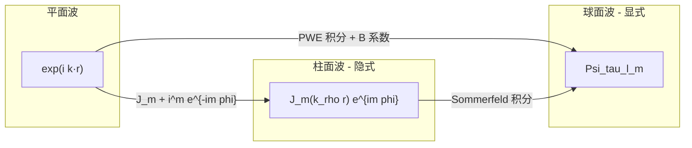
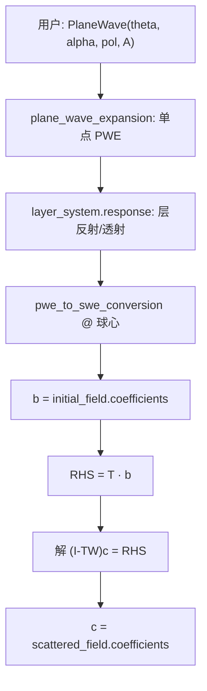

# SMUTHI 学习笔记：从平面波到散射系数

> 面向第一次读 SMUTHI 源码的读者。目标：搞懂「入射平面波怎么变成系数向量 **b**，再怎么参与多重散射」。

---

## 一、SMUTHI 在算什么？

**SMUTHI** = *Scattering by Multiple Particles in Thin-film Systems*  
中文：**薄层（多层）介质里，多个粒子怎么散射光**。

可以把它想成三层问题：

```
入射光（平面波 / 高斯束 / 偶极子）
    ↓
经过各层介质的反射、透射
    ↓
打到每个粒子上 → 粒子散射 → 粒子之间互相「照亮」
    ↓
最终：每个粒子散射出去多少（散射系数 c）
```

**类比**：几个人在两面镜子之间用手电筒互照——不仅要算「第一束光打到 A」，还要算「B 散射的光又照到 A」。

---

## 二、为什么要用「展开系数」？

电磁场是连续函数 $\mathbf{E}(\mathbf{r})$，计算机不能直接存整个空间。  
SMUTHI 的做法：**选一组基函数，用系数向量表示场**。

| 表示方式 | 像什么 | 代码里的类 |
|---------|--------|-----------|
| 平面波展开 PWE | 很多不同方向的平面波叠加 | `PlaneWaveExpansion` |
| 球面波展开 SWE | 很多「多极子」叠加（像天线辐射模式） | `SphericalWaveExpansion` |

**核心流程**：

```
平面波  →  [变换]  →  球面波系数 b  →  线性方程  →  散射系数 c
```

你关心的 **b**，在代码里叫 `particle.initial_field.coefficients`。

---

## 三、三种波，一张图看懂



- **平面波**：$e^{i(k_x x + k_y y + k_z z)}$，方向由 $(\theta, \alpha)$ 定。
- **柱面波**：按方位角 $m$ 分模，径向是 $J_m(k_\rho r)$——SMUTHI **没有单独叫 `jacobi_anger_excitation` 的函数**，但粒子耦合里用到了。
- **球面波**：按 $(\tau, l, m)$ 分模，$\tau$=TE/TM，$l$=阶数，$m$=方位阶——**粒子散射主要用这个**。

---

## 四、文件地图（按阅读顺序）

| 顺序 | 文件 | 干什么 |
|------|------|--------|
| 1 | `vector_wave_functions.py` | 定义平面波、球面波基函数，以及两者之间的 **B 系数** |
| 2 | `field_expansion.py` | PWE/SWE 类；**PWE→SWE 转换**（算 b 的核心） |
| 3 | `initial_field.py` | 入射场（PlaneWave 等）→ 调用上面转换 |
| 4 | `layers.py` | 多层介质的反射/透射 |
| 5 | `particle_coupling.py` | 粒子之间怎么耦合（含 Jacobi–Anger + Bessel） |
| 6 | `linear_system.py` | 组装并求解 `(I - TW) c = T b` |

SMUTHI 仓库路径：`~/repos/smuthi/smuthi/`。

---

## 五、模块 1：矢量波函数（`vector_wave_functions.py`）

### 5.1 平面波 PVWF

```python
# 简化理解
scalar = exp(i * (kx*x + ky*y + kz*z))
# TE (pol=0): Ex, Ey 在 xy 面内垂直于传播方向
# TM (pol=1): 电场含 Ez 分量
```

- `kp` = 横向波数 $k_\parallel = \sqrt{k_x^2+k_y^2}$
- `alpha` = 方位角（$k_x = k_p\cos\alpha$）
- `kz` = 纵向波数

### 5.2 球面波 SVWF

每个模式用四个量子数：

| 符号 | 含义 |
|------|------|
| `nu=1` | 正则波（$j_l$，像入射） |
| `nu=3` | 出射波（$h_l^{(1)}$，像散射） |
| `tau=0/1` | 球面 TE / TM |
| `l, m` | 角动量量子数 |

### 5.3 B 系数：平面波 ↔ 球面波的「翻译表」

```python
transformation_coefficients_vwf(tau, l, m, pol, kp, kz, dagger=True/False)
```

- `dagger=True`：平面波 → 球面波（算 **b** 时用）
- `dagger=False`：球面波 → 平面波

**直觉**：固定传播方向 $(k_x,k_y,k_z)$ 时，一个平面波 TE/TM 模式，可以写成各 $(\tau,l,m)$ 球面模式的线性组合；B 就是组合系数。

---

## 六、模块 2：平面波展开 PWE（`field_expansion.py`）

### 6.1 数据结构

```python
PlaneWaveExpansion:
    coefficients[pol, i_kp, i_alpha]  # pol: 0=TE, 1=TM
    k_parallel[]                       # 横向波数列表
    azimuthal_angles[]                 # 方位角列表
    kind = 'upgoing' / 'downgoing'     # 向上/向下传播
```

**两种用法**：

1. **只有一个 (kp, alpha)** → 就是「一个平面波」（δ 函数）
2. **很多 (kp, alpha) + 权重** → 高斯束等（对 kp、alpha 积分）

### 6.2 场怎么重建

对每个格点 $(x,y,z)$，把所有 $(\kappa,\alpha)$ 上的平面波按权重加起来（代码里用 `trapz` 积分）。

---

## 七、模块 3：入射平面波怎么构造 PWE（`initial_field.py`）

以 `PlaneWave` 为例，**5 步**：

```
步骤 1：根据 polar_angle, azimuthal_angle 算 kx, ky, kz
步骤 2：在激发层构造 PWE，只在 coefficients[pol, 0, 0] 填振幅（单平面波）
步骤 3：layer_system.response() → 层间反射/透射 → 得到 pwe_up, pwe_down
步骤 4：pwe_to_swe_conversion(pwe_up) + pwe_to_swe_conversion(pwe_down)
步骤 5：得到 SWE 系数 → 这就是 b
```

对应代码链：

```python
# initial_field.py
def spherical_wave_expansion(self, particle, layer_system):
    pwe_up, pwe_down = self.plane_wave_expansion(layer_system, i)
    return pwe_to_swe_conversion(pwe_up, ...) + pwe_to_swe_conversion(pwe_down, ...)
```

---

## 八、核心：`pwe_to_swe_conversion` — 平面波 → 向量 b

**文件**：`field_expansion.py` 第 761 行起。

### 8.1 在算什么？

在粒子中心 $\mathbf{r}_P$，把 PWE 表示的场，投影到正则球面波基上，得到 $a_{\tau lm}$（即 **b** 的分量）。

### 8.2 算法（白话版）

对每个 $(\tau, l, m)$：

1. **相位修正**：PWE 参考点与粒子中心可能不同 → 乘 $e^{i\mathbf{k}\cdot\Delta\mathbf{r}}$
2. **提取 m 阶方位角**：乘 $e^{-im\alpha}$（对 alpha 积分 = 傅里叶系数）
3. **偏振变换**：对 TE/TM 分别用 $B^\dagger_{\tau lm, j}$
4. **对 kp 积分**（单平面波时跳过，直接取值）
5. **乘 4**（积分测度换算）

伪代码：

```python
for m in -m_max .. m_max:
    for l in max(1,|m|) .. l_max:
        for tau in 0, 1:
            b[tau,l,m] = 0
            for pol in TE, TM:
                b[tau,l,m] += B_dagger(tau,l,m,pol) * exp(-i*m*alpha) * g[pol] * phase
            b[tau,l,m] *= 4   # 单平面波时
```

### 8.3 单平面波时的简化公式

若只有一个入射方向 $(\theta_P, \alpha_P)$、偏振 $j_P$、振幅 $A$：

$$
b_{\tau lm} \approx 4 \cdot A \cdot e^{i\mathbf{k}\cdot(\mathbf{r}_P-\mathbf{r}_0)} \cdot e^{-im\alpha_P} \cdot B^\dagger_{\tau lm, j_P}(\theta_P)
$$

和测试脚本 `/tmp/0_besell_test.py` 里的 $b_m = i^m e^{-im\phi_\mathrm{inc}}$ 相比，SMUTHI 多了：

- 振幅 $A$、参考点相位
- 极角 $\theta$ 的矢量变换 $B^\dagger$（而不只是方位角 $m$）
- $(\tau, l)$ 而不只是 $m$

---

## 九、b 向量的下标怎么排？

函数 `multi_to_single_index(tau, l, m, l_max, m_max)` 把 $(\tau,l,m)$ 压成一维。

**顺序**：先 `tau=0` 的全部 $(l,m)$，再 `tau=1` 的全部 $(l,m)$。

例：`l_max=3, m_max=3` → 每个 tau 16 个 → 共 **32 维**。

测试文件 `tests/unit_tests/initial_field_tests/test_initial_field.py` 里有 golden value，例如 `aI[0] ≈ 0.038 + 0.750i`。

---

## 十、线性系统：b 之后发生什么？

**文件**：`linear_system.py`

```
1. compute_initial_field_coefficients()
   → 每个 particle.initial_field = spherical_wave_expansion(...)  # 得到 b

2. right_hand_side()
   → RHS = T · b   （T 是单粒子 T 矩阵）

3. 求解 (I - T·W) · c = T·b
   → c = 散射系数（存在 particle.scattered_field.coefficients）
```

**符号**：

| 符号 | 含义 |
|------|------|
| **b** | 入射场在粒子处的球面波展开（正则） |
| **T** | 单粒子散射矩阵 |
| **W** | 粒子间耦合（直接 + 层介导） |
| **c** | 待求的散射系数 |

---

## 十一、Jacobi–Anger 在 SMUTHI 哪里？

测试脚本 `/tmp/0_besell_test.py` 里有：

```python
bm = (1j)**m * exp(-1j * m * phi_inc)
k_rho = k0 * sin(theta_inc)
```

**SMUTHI 没有同名函数**，但同一数学出现在两处：

### 11.1 入射投影（部分）

`pwe_to_swe_conversion` 里的 `exp(-1j * m * alpha)` = $e^{-im\phi_\mathrm{inc}}$。  
`i^m` 被吸收在 Doicu 记号的 $B^\dagger$ 约定里。

### 11.2 粒子耦合（完整）

`particle_coupling.py`：

```python
# 层间耦合
4 * (1j)**|m2-m1| * exp(1j*(m2-m1)*phi) * J_|m2-m1|(kp * rho)

# PVWF 介导耦合
4 * 1j**|m2-m1| * exp(1j*phi*(m2-m1)) * J_|m2-m1|(kp*rho)
```

这就是 Jacobi–Anger 恒等式：

$$
e^{i k_\rho \rho \cos(\phi-\phi_0)} = \sum_m i^m e^{-im\phi_0} J_m(k_\rho\rho)\, e^{im\phi}
$$

**用途对比**：

| | 测试脚本 CMM | SMUTHI |
|---|---------|--------|
| 目的 | 平面波 → 柱模权重 $b_m$ | 粒子间在 $(\rho,\phi)$ 传递场 |
| 基 | $J_m e^{im\phi}$ | SVWF + Sommerfeld 积分 |
| 输出 | `{m: b_m}` | 耦合矩阵 $W$ 的元素 |

---

## 十二、完整数据流（平面波入射单球）



---

## 十三、和 CMM 脚本的对应

`CoreShellRingSolver` + `jacobi_anger_excitation`：

```
本征模求解 → beta_p, c1,c2,c3
jacobi_anger_excitation → b_m
b_m × 本征场 → 交叠积分 → 激发布局 → S 矩阵
```

SMUTHI 的对应：

```
T 矩阵（单粒子）代替本征模
pwe_to_swe_conversion 代替 jacobi_anger_excitation（但基是球面波不是 J_m）
T·b 是 RHS
(I-TW)^-1 T·b 是最终散射
```

**为何 SMUTHI 不用纯 $J_m$？**  
粒子是 3D 的，球面矢量波比 2D 柱模更自然；层状介质用 PWE（k 空间）处理层响应更方便。

---

## 十四、建议阅读顺序 + 自测

### 阅读顺序

1. `vector_wave_functions.py`：`plane_vector_wave_function`、`transformation_coefficients_vwf`
2. `field_expansion.py`：`PlaneWaveExpansion`、`pwe_to_swe_conversion`
3. `initial_field.py`：`PlaneWave.plane_wave_expansion`、`spherical_wave_expansion`
4. `linear_system.py`：`compute_initial_field_coefficients`、`right_hand_side`
5. `particle_coupling.py`：`layer_mediated_coupling_block`（可选，看 Jacobi–Anger）

### 自测问题

1. `coefficients[pol, 0, 0]` 非零、其余为 0 → 表示什么？
2. `dagger=True` 和 `False` 分别用于什么方向？
3. `pwe_up + pwe_down` 为什么要加两次 `pwe_to_swe_conversion`？
4. `(I-TW)c = Tb` 里 W 不含 T，为什么？

<details>
<summary>参考答案</summary>

1. 单一平面波。
2. True：PWE→SWE（算 b）；False：SWE→PWE。
3. 层内同时有向上、向下传播分量，都要投影到球心。
4. 方程来自场匹配：$c = T(b + Wc)$，移项得 $(I-TW)c = Tb$。

</details>

---

## 十五、关键测试（可跑验证）

| 测试文件 | 验证什么 |
|---------|---------|
| `tests/unit_tests/initial_field_tests/test_initial_field.py` | 平面波 → **b** 的数值 |
| `tests/unit_tests/vwf_and_transformations_tests/test_field_expansion_transformation.py` | PWE↔SWE 往返误差 < 0.5% |
| `tests/unit_tests/multiple_scattering_tests/test_plane_wave_coupling.py` | Jacobi–Anger 耦合 vs 球面加法定理 |

在 SMUTHI 仓库根目录运行（需安装 smuthi 依赖）：

```bash
cd ~/repos/smuthi
pytest tests/unit_tests/initial_field_tests/test_initial_field.py -v
```

---

## 十六、与 simulation_toykits 的关联

infrastructure 中已有相关积木，但尚未实现平面波投影：

| 已有 | 路径 | 状态 |
|------|------|------|
| 柱坐标 Bessel 基 | `infrastructure/include/kernels/polynomial/bessel.hpp` | 已实现 |
| 平面波场评估 | `infrastructure/include/kernels/source/plane_wave.hpp` | 已实现 |
| 平面波 → 柱/球模投影 | `infrastructure/include/kernels/kspace/plane_wave_expansion.hpp` | **空文件，待实现** |

若要在 C++ 侧复刻 SMUTHI 的 `pwe_to_swe_conversion` 或测试脚本的 `jacobi_anger_excitation`，可参考本笔记第八、十一节。

---

## 十七、一句话总结

> SMUTHI 把入射平面波先变成 PWE（含层响应），再用 $B^\dagger$ 和 $e^{-im\alpha}$ 投影成粒子中心的球面波系数 **b**；**b** 经 T 矩阵进右端项，与粒子耦合 W 一起解出散射 **c**。Jacobi–Anger 没有单独封装，但出现在 PWE→SWE 的方位角因子和粒子耦合的 $J_m$ 积分里。
