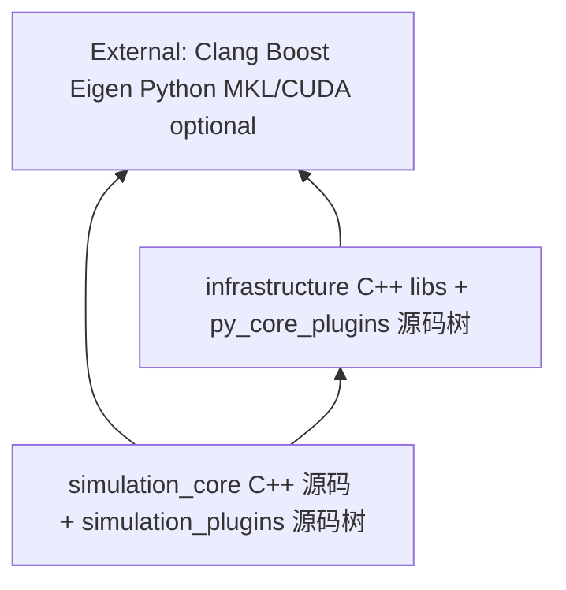
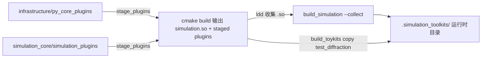
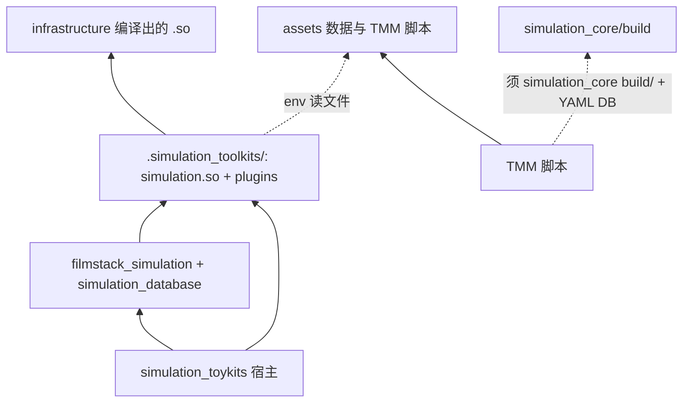
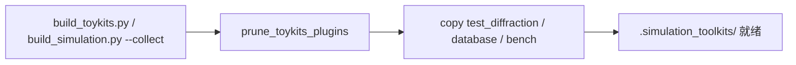

# simulation_toykits 部署与架构指南

面向开发者的部署与架构说明：项目分层、运行时契约、`local` / `docker` / `hf` SOP。

系统包、venv、首次运行见 [README.MD](../README.MD)。

---

## 1. 引言

### 读者与用途

- **读者**：改 C++ / Python 插件 / Streamlit 页面，或负责 CI / Docker / HF 的开发者。
- **用途**：理解 `.simulation_toolkits/` 内容；改代码后选对 deploy 命令；正确配置 `PYTHONPATH` / `SIMULATION_*`。

### 前置

```bash
git clone https://github.com/likooooo/simulation_toykits.git
cd simulation_toykits
git submodule update --init --recursive simulation_core
```

系统依赖、Python venv、`requirements.txt` 安装见 [README.MD](../README.MD) 与 [simulation_core/README.md](../simulation_core/README.md)。

---

## 2. 项目架构

### 2.1 箭头约定

全文统一：**`A → B` = A 依赖 B**（A 需要 B 才能编译 / import / 运行）。

**不用依赖箭头表示**：

- deploy 文件拷贝（sync / collect）；
- 环境变量读磁盘路径（用虚线或单独表格）。

### 2.2 编译期依赖（CMake / link）

严格单向 DAG；`assets/` 不参与此图。



依据：

- [`simulation_core/CMakeLists.txt`](../../simulation_core/CMakeLists.txt) → `BootstrapInfrastructure.cmake` / `find_package(infrastructure)`
- [`simulation_core/src/CMakeLists.txt`](../../simulation_core/src/CMakeLists.txt) → link `infrastructure::py_visualizer`、`uca`、`mekil`、`kernels`
- **infrastructure 不反向依赖 simulation_core**（独立 subproject）
- **CMake 不引用 `assets/`**

### 2.3 部署产物（拷贝流水线，非 import 依赖）



依据：[`StageRuntime.cmake`](../../simulation_core/cmake/StageRuntime.cmake)、[`build_simulation.py`](../../simulation_core/scripts/build_simulation.py) 内联 collect、[`build_toykits.py`](build_toykits.py)。

### 2.4 运行时依赖（消费者视角，单向）

主图仅画消费者 → runtime → infrastructure；不画 runtime 内部的 init 回边（见下文说明）。



**运行时依赖表**：

| 依赖边 | 依据 |
|--------|------|
| 宿主 `pages/` → 可移植包 | 如 [`pages/filmstack_toolkits/filmstack simulation.py`](../../pages/filmstack_toolkits/filmstack%20simulation.py) |
| 可移植包 → runtime | 入口 `import simulation`（eager-load 插件）；业务代码直接 `import filmstack_visualizer` 等 |
| 可移植包 **不** → 宿主 | 禁止 `from core` / `from pages` / `from ui` |
| `import simulation` → eager-load 插件 | [`py_plugin.cpp`](../../simulation_core/3rdparty/infrastructure/src/py_visualizer/py_plugin.cpp) 中 `initialize_py_runtime` / `load_all_plugins`：按传入的 `plugin_paths` 顺序加载（toykits 构造为 `py_core_plugins` 先于 `simulation_plugins`） |
| `simulation_plugins` → `py_core_plugins` | 如 `filmstack_optimization_utils` → `pipe_utils`；`filmstack_visualizer` → lazy `viz_io` |
| **无** `py_core_plugins` → `simulation_plugins` | 无反向 import |
| C++ → Python 插件 | [`simulation_database.cpp`](../../simulation_core/src/simulation_database.cpp) 调用 `simulation_database_parser` |
| TMM 脚本 → runtime | notebook / 测试 `import simulation` |

**init 顺序说明**：`import simulation` 会 eager-load `simulation_plugins`，部分插件在业务函数内再 `import simulation` 取 API。源码无 import cycle，但有 init 顺序约束（函数内 lazy import / `sys.modules["simulation"]` 解开）。架构图不画 `SPL → SimMod` 回边。

### 2.5 分层职责

| 层 | 路径 | 依赖谁 | 被谁依赖 |
|----|------|--------|----------|
| External | 系统 / PyPI | — | infrastructure、simulation_core |
| infrastructure | `3rdparty/infrastructure/` | External | simulation_core C++ build |
| simulation_core 源码 | C++ + `simulation_plugins/` | infrastructure、External | deploy → runtime；TMM 脚本 |
| assets | `assets/ipynb/` | —（数据） | runtime / TMM **经 env 读取** |
| `.simulation_toolkits/` | collect 产物 | 由 build 生成 | 所有 `import simulation` |
| 可移植包 | `filmstack_simulation/`（含嵌套 `filmstack_optimization/`）、`simulation_database/` | runtime | toykits `pages/` |
| toykits 宿主 | `app.py`、`pages/`、`core/`、`common.py` | 可移植包 + runtime | 最终用户 |

**可移植性**：可移植包 + runtime artifacts 可脱离宿主部署；**禁止** 可移植包 import 宿主模块。

### 2.6 目录职责速查

| 路径 | 职责 |
|------|------|
| [`simulation_core/3rdparty/infrastructure/py_core_plugins/`](../../simulation_core/3rdparty/infrastructure/py_core_plugins/) | 通用 viz、pipe 等（源码树约 18 模块；toykits collect 后 **prune** 仅保留 5 个，见 §3.1） |
| [`simulation_core/simulation_plugins/`](../../simulation_core/simulation_plugins/) | simulation 耦合插件（`filmstack_visualizer`、`simulation_database_parser`、`tmm_utils` 等） |
| [`filmstack_simulation/`](../../filmstack_simulation/)、[`simulation_database/`](../../simulation_database/) | 可拷贝到其他 Streamlit 项目 |
| [`core/`](../../core/)、[`pages/`](../../pages/)、[`ui/`](../../ui/)、[`app.py`](../../app.py) | 宿主胶水，不可被可移植包依赖 |
| [`.simulation_toolkits/`](../../.simulation_toolkits/) | gitignore 运行时产物目录 |

### 2.7 已知限制

| 项 | 说明 |
|----|------|
| 环境变量 | 由 [`init-toykits-build-env.sh`](init-toykits-build-env.sh)（纯 bash export，不校验目录存在）统一设置 |

---

## 3. 部署依赖基础知识

### 3.1 `.simulation_toolkits/` 内容

collect（[`build_simulation.py --collect`](../../simulation_core/scripts/build_simulation.py)）后，[`build_toykits.py`](build_toykits.py) 还会 `prune_toykits_plugins` 与 database/bench 步骤。期望布局：

| 内容 | 来源 |
|------|------|
| `simulation.so` | CMake build |
| 非系统 `.so`（如 `libuca.so`、`libpy_visualizer.so`） | `ldd` 递归收集 |
| `py_core_plugins/`（**allowlist**） | stage 后 prune：仅 `visualizer.py`、`viz_io.py`、`pipe_utils.py`、`panel_renderer.py`、`plot_source.py` |
| `simulation_plugins/`（**allowlist**） | stage 后 prune：仅 `simulation_database_parser.py`、`filmstack_visualizer.py`、`filmstack_optimization_utils.py`、`layer_visualizer.py`、`simulation_paths.py`、`tmm_utils.py` |
| `test_diffraction` | `build_toykits` 从 `build/` 额外复制（衍射角计算器） |
| `assets/database.bin` 等 | `--database` / 全量 build 预编译材料库（明文 YAML 在 release 路径下会移除） |
| `assets/fs_compare/` 等 | `--bench` / 全量 build 对照产物 |

源码树里未进 allowlist 的插件（如 `compare_data`、`matlab_io`）**不会**出现在 toykits runtime。

### 3.2 deploy 流水线（toykits）



实现：默认 `build_toykits.py` 全量编译；`build local` / `build docker` / `build hf` / `build release` 先编译再消费；单独 `local` / `docker` / `hf` / `release` **不隐式编译**（也不 sync 插件）。

### 3.3 环境契约

**原则**：`PYTHONPATH`、`LD_LIBRARY_PATH` 与 `SIMULATION_*` 由 shell / CI / Docker 经 `source init-*-env` 设置；init 脚本**仅 export 预期路径**，不校验目录是否已存在（可在 `build_*.py` 之前 source）。产物是否就绪由 collect、`import simulation`、pytest 等后续阶段校验。Python 业务代码**不**做 `sys.path` 探测、**不** `try/except` 包裹 `import simulation`。

| 变量 | toykits 典型值 | 用途 |
|------|----------------|------|
| `SIMULATION_ARTIFACTS_DIR` | `{repo}/.simulation_toolkits` | `simulation.so` 与插件目录；C++ 经该环境变量解析插件路径 |
| `PYTHONPATH` | `{repo}:{artifacts}` | 见 [`init-toykits-build-env.sh`](init-toykits-build-env.sh) |
| `LD_LIBRARY_PATH` | `{artifacts}` | 动态库 |
| `SIMULATION_DATABASE_DIR` | `{artifacts}/assets` | 预编译 `database.bin` 目录 |
| `GENERATE_GOLDEN_TOOLS_DIR` | 默认 `~/repos/simulation_baseline_tools` | 对照工具树（可选） |

**TMM**（Oghma 对齐）**不要**用 toykits init / `.simulation_toolkits`。须：

```bash
source simulation_core/scripts/init-simulation-build-env.sh build
bash simulation_core/assets/ipynb/simulation/TMM/run_tmm.sh test   # 或 jupyter
```

`run_tmm.sh` 要求 YAML 材料库（`assets/database/og/materials`）与 `simulation_core` Release `build/` 中的 `simulation.so`。

toykits Streamlit / pytest 推荐：

```bash
source scripts/init-toykits-build-env.sh
```

### 3.4 `import simulation` 铁律

1. 先 `source init-*-env`（设置 `SIMULATION_*` / `PYTHONPATH` / `LD_LIBRARY_PATH`）
2. `import simulation` 后 C++ 自动 eager-load `py_core_plugins`，再 eager-load `simulation_plugins`
3. 业务代码直接 `import filmstack_visualizer`、`import tmm_utils` 等

入口示例：[`app.py`](../../app.py) 为纯 Streamlit；`build_toykits local` 由脚本设置 `LD_LIBRARY_PATH` 后启动 Streamlit。

### 3.5 运行场景对照

| 场景 | artifacts | PYTHONPATH 要点 | cwd |
|------|-----------|-----------------|-----|
| toykits Streamlit / pytest | `.simulation_toolkits` | 含 repo root | `{repo}` |
| simulation_core ctest | `build/` | `${CMAKE_BINARY_DIR}` only | `build/` |
| Docker / HF Space | `/app/.simulation_toolkits` | `/app` + artifacts | `/app` 或 artifacts |
| TMM Oghma 对齐测试 | `simulation_core/build`（**不是** `.simulation_toolkits`） | sim init 设置 | TMM 脚本目录（`run_tmm.sh` cd） |

独立 core 开发：[`simulation_core/scripts/init-simulation-build-env.sh`](../../simulation_core/scripts/init-simulation-build-env.sh)（无 repo root）。

---

## 4. 标准操作程序（SOP）

### SOP-0：环境准备（一次性）

1. 系统包 + venv + `pip install -r requirements.txt`（见 README）
2. `git submodule update --init --recursive simulation_core`
3. 手动 pytest / 调试前可选：`source scripts/init-toykits-build-env.sh`

### SOP-1：首次本地运行

**编译路径**（需 `simulation_core` 子模块 + `requirements-build.txt`）：

```bash
source .venv/bin/activate
pip install -r requirements-build.txt
python scripts/build_toykits.py    # 全量：toolkits + database + bench（无需事先 source init）
```

**消费路径**（仅需 artifact，CI 同款）：

```bash
pip install -r requirements.txt
python scripts/build_toykits.py --download_toolkits
source scripts/init-toykits-build-env.sh
python scripts/build_toykits.py local
```

`local` 仅启动 Streamlit；artifact 缺失时报错并提示 build 或 download。

### SOP-2：日常开发 — 改了什么、跑什么

| 改动类型 | 操作 | 是否重启 Streamlit |
|----------|------|-------------------|
| `simulation_plugins/` 或 `py_core_plugins/` Python | **必须** `python scripts/build_toykits.py` 或 `--toolkits`（`local` **不** sync 插件） | 插件生效后通常需重启；仅宿主页面改动可自动重载 |
| C++ / `simulation.so` | `python scripts/build_toykits.py`（或 `build local`） | **是** |
| 宿主 `pages/` / `core/` / 可移植包 UI | 无需 collect | 否（Streamlit 自动重载） |

### SOP-3：Docker 本地镜像

```bash
export SIMULATION_DATABASE_KEY=...   # 验证容器内 database.bin 解密
python scripts/build_toykits.py docker
docker run -e SIMULATION_DATABASE_KEY=... -p 8052:8052 simulation-toykits:v1
```

流程：检查 artifact → `docker build -f Dockerfile` → `verify_docker_image()`（须 `SIMULATION_DATABASE_KEY`）。

### SOP-4：Hugging Face Space 部署

**CI 自动**（[`.github/workflows/ci.yml`](../../.github/workflows/ci.yml) push main）：`--download_toolkits` → pytest → `python scripts/build_toykits.py hf`。

**手动前置**：

- HF SSH 公钥与 GitHub `secrets.MY_PRIVATE_KEY_1` 配对

`deploy_hf` 行为：clone Space → 清空（保留 `.git`）→ 写 `Dockerfile.hugging_face` + README（BUILD_TIME + commit 信息）→ `git push --force`。HF Docker 构建时 HTTPS 克隆应用层，并从 [simulation_toolkits_artifacts](https://github.com/likooooo/simulation_toolkits_artifacts) **latest Release** 下载 `.simulation_toolkits/`。

详见 [README.MD](../README.MD) HF 章节与 [`Dockerfile.hugging_face`](../../Dockerfile.hugging_face)。

### SOP-5：验证清单

```bash
# Smoke
source scripts/init-toykits-build-env.sh
python -c "import simulation; import filmstack_visualizer; print('OK')"

# 单元测试
source scripts/init-toykits-build-env.sh
python -m pytest test/ -v

# collect 完整性
test -f .simulation_toolkits/simulation_plugins/filmstack_visualizer.py
test -f .simulation_toolkits/simulation.so
```

Docker：由 `verify_docker_image()` 在 `build_toykits docker` 末尾自动执行。

### SOP-6：常见故障

| 现象 | 检查 |
|------|------|
| `ImportError: simulation` | 是否 `source scripts/init-toykits-build-env.sh`；`PYTHONPATH` 是否含 repo root 与 `.simulation_toolkits` |
| 插件来自源码树而非 deploy 副本 | 重跑 `build_toykits`；确认已 `source scripts/init-toykits-build-env.sh` |
| `SIMULATION_ARTIFACTS_DIR` 未设置 | 先 `build_toykits` 或 `source scripts/init-toykits-build-env.sh` |
| HF push 失败 | `HF_ENDPOINT`、SSH 密钥、Space 写权限 |

### build_toykits.py

| 调用 | 作用 |
|------|------|
| （默认）/ `build` | 全量编译 |
| `--toolkits` / `--bench` / `--database` | 正向 flag，只跑列出的 build 步骤 |
| `build local` / `build docker` / `build hf` / `build release` | 编译后接消费步骤 |
| `local` / `docker` / `hf` / `release` | 仅消费（artifact 须已存在） |
| `--download_toolkits` | 拉 GitHub Release latest |

示例：

```bash
python scripts/build_toykits.py build release   # 编译 + 发布
python scripts/build_toykits.py build local     # 编译 + Streamlit
python scripts/build_toykits.py --toolkits build local  # 仅 toolkits 后启动
```

---

## 5. 相关文件索引

| 类别 | 文件 |
|------|------|
| CLI | [`build_toykits.py`](build_toykits.py) |
| Shell env | [`init-toykits-build-env.sh`](init-toykits-build-env.sh) |
| 路径解析 | [`simulation_core/simulation_plugins/simulation_paths.py`](../../simulation_core/simulation_plugins/simulation_paths.py) |
| Collect / build | [`build_simulation.py`](../../simulation_core/scripts/build_simulation.py)、[`build_inf.py`](../../simulation_core/3rdparty/infrastructure/build_inf.py) |
| Docker | [`Dockerfile`](../../Dockerfile)、[`Dockerfile.hugging_face`](../../Dockerfile.hugging_face) |
| CI | [`.github/workflows/ci.yml`](../../.github/workflows/ci.yml) |
