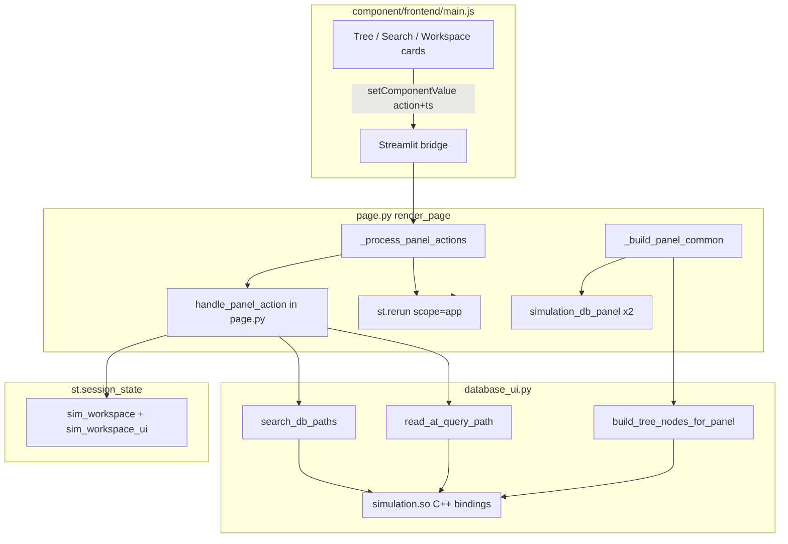

# simulation_database

仿真数据库 Streamlit 模块：浏览 release 树（`oghma_database/materials`、`oghma_database/spectra` 等）、构建工作区、仿真波长范围、Plotly 预览。

拷贝本目录及宿主自备的 `simulation.so` 与数据库数据，即可在其他 Streamlit 项目中复用。

## 模块边界

| 职责 | 文件 |
|------|------|
| 页面编排 | `page.py` — `render_page()`、主题、组件、panel action |
| 自定义组件 | `component/frontend/` — 树浏览、搜索、工作区卡片 |
| 会话模型 | `workspace.py` — `SimWorkspace` / `SimWorkspaceUI` |
| DB 读写/搜索 | `database_ui.py` |
| 图表 | `plots.py`（Plotly theme） |
| 运行时 | 宿主设置 `SIMULATION_ARTIFACTS_DIR` + `PYTHONPATH` 后 `import simulation` |

下游（Filmstack Simulation、Diffraction angle）通过 `get_workspace_materials()` 读取 `st.session_state["sim_workspace"]`。

## 运行时架构



同页挂载 browser / workspace 两个组件实例，共享 session。JS 上报 action 触发 rerun；`page.py` 按 `(ts, priority)` 去重后执行 `handle_panel_action`。

## 状态与行为

**Session**：`sim_workspace` / `sim_workspace_ui`（schema=4）、`sim_db_wl_from/to`、`_sim_db_ready` 等。

**浏览**：树/搜索互斥（搜索 300ms debounce）；leaf 单击 preview、双击 add；卡片 focus/remove；清空 reset 工作区。

**预览**：数据源优先级 preview > focus > last_added > 末项。用户改仿真波长后进入 manual 模式；范围不足时卡片 warn。

**下载**：开启 download 后 add/focus 触发 C++ `obj.dump` → CSV 本地导出（非在线拉取材料库）。

**去重**：双 panel 取 ts 最大；priority add(5) > focus(4) > remove/clear(3) > preview(1)；前端 add/focus 限流 400ms/350ms。

## Action 表

| Action | 触发 | 效果 |
|--------|------|------|
| `expand` / `collapse` | 树 chevron | 更新 `expanded_paths` |
| `search` / `clear_search` | 搜索框 / Escape | 切换树/搜索 |
| `preview` | leaf 单击 | 临时预览 |
| `add` | leaf 双击 | 写入 workspace + focus |
| `focus` | 卡片点击 | 设 focus，清 preview |
| `remove` | 卡片 × | 删除条目 |
| `clear_workspace` | 清空 | reset 工作区与波长 auto |
| `download_toggle` | checkbox | 切换下载模式 |

## C++ 调用链

```
simulation_database_parser.get_simulation_database(init=True)

build_tree_nodes_for_panel → sim_db.query / descend
read_at_query_path         → sdp.read_at_query_path (db.read_at_path)
search_db_paths            → Python DFS + infer_yml_leaf_kind（无 C++ 对象 load）
material_nk_arrays         → get_tabulated_values()
dump_object_as_csv         → obj.dump(tmpdir)
```

## 外部依赖

| 项 | 说明 |
|----|------|
| `simulation.so` + 依赖 `.so` | `SIMULATION_ARTIFACTS_DIR` |
| `simulation_plugins/simulation_database_parser.py` | artifacts 目录内；C++ 经插件名调用 |
| 数据库数据 | `SIMULATION_DATABASE_DIR` → release 树（如 `oghma_database/materials/`、`oghma_database/spectra/`、`refractive_index_info_database/materials/refractive_index_info/` 等） |
| Python | `streamlit`, `plotly`, `numpy`, `pyyaml` |

## 集成指南

运行前 `source scripts/init-toykits-build-env.sh`（或宿主等价 init 脚本）。环境变量细节见 [simulation_toykits_deploy.md](../scripts/simulation_toykits_deploy.md) §3.3。

```python
from pathlib import Path

import streamlit as st
import simulation_database_parser as sdp

from simulation_database.page import render_page

if "_sim_db_ready" not in st.session_state:
    sdp.get_simulation_database(init=True)
    st.session_state["_sim_db_ready"] = True

render_page(tokens_path=Path("ui/design_tokens.css"))
```

| 变量 | 默认 | 说明 |
|------|------|------|
| `SIMULATION_ARTIFACTS_DIR` | `{repo}/.simulation_core` | `simulation.so` 目录 |
| `SIMULATION_DATABASE_DIR` | collect 后 `{repo}/.simulation_core/assets/database`；开发/构建可用源码树 `simulation_core/assets/database` | release 树根（非 import） |
| `SIMULATION_TMM_ASSETS_DIR` | `{simulation_core}/assets/ipynb/simulation/TMM` | TMM 资源 |
| `PYTHONPATH` | `{repo}:{artifacts}` | init 脚本设置 |

**默认工作区**：standalone 模式下 `render_page()` 调用 `ensure_workspace_initialized(sim_db)` 时不传入 path keys，工作区初始为空；材料与光谱须用户手动 add。**simulation_toykits 宿主**在 `app.py` 启动时预加载 `DEFAULT_MATERIAL_PATH_KEYS` 与 [`toykits_config.DEFAULT_SPECTRUM_PATH`](../toykits_config.py)（AM1.5G）光谱。

**公开 API**：

- `simulation_database.page.render_page(*, tokens_path: Path)`
- `simulation_database_parser.get_simulation_database()` / `materials_db_from_token_paths()`
- `simulation_database.database_ui.material_nk_arrays()` / `search_material_paths()`
- `simulation_database.workspace.ensure_sim_workspace()` / `get_workspace_materials()` / `ensure_workspace_initialized()` / `ensure_sim_workspace_ui()`

## 模块结构

| 路径 | 职责 |
|------|------|
| `page.py` | 页面编排、panel action、样式注入 |
| `component/` | 自定义 Streamlit 组件 |
| `database_ui.py` | DB 读写/搜索 |
| `workspace.py` | 工作区会话 |
| `plots.py` | Plotly 图表 |
| `pages/filmstack_toolkits/simulation database.py` | toykits 多页 wrapper（传入 `tokens_path`） |
